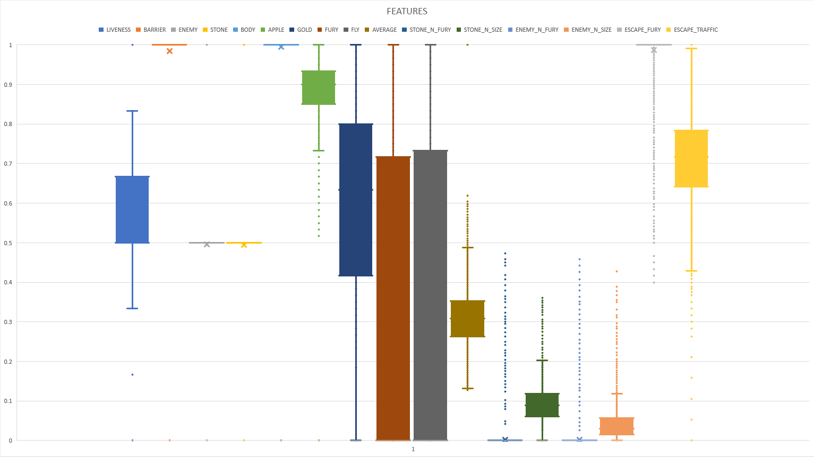

# snakebattle
codenjoy snakebattle bot

# more info
- http://codenjoy.com/
- https://github.com/codenjoyme/codenjoy

# build
```
mvn clean compile assembly:single
```

# start
```
java -jar target/snakebattle-client-jar-with-dependencies.jar
```
OR
```
java -jar target/snakebattle-client-jar-with-dependencies.jar <SOLVER> <HASH 1> <CODE 1> <STAT_FILENAME 1> ... <HASH n> <CODE n> <STAT_FILENAME n>
```
where 
```
SOLVER: "BFS" | "GA" | "RL"
```
Examples:
```
java -jar snakebattle-client-jar-with-dependencies.jar "BFS" "keme1dgf50kkvavrwzln" "285147973966974500" "bot1.json"
java -jar snakebattle-client-jar-with-dependencies.jar "GA" "6ejguzn33aqhhawzdyao" "3485839216718225428" "bot3.json" "nq0g7eyaofe0a8xrplph" "3242248498438480567" "bot4.json"
```

# internal details
- game state - [State.java](src/main/java/com/github/illya13/snakebattle/State.java)
- solver interface - [Solver.java](src/main/java/com/github/illya13/snakebattle/Solver.java) 
- simplest but efficient `closest item` solver (BFS-based with manual constraints validation) - [BFSSolver.java](src/main/java/com/github/illya13/snakebattle/solver/BFSSolver.java)
- set of features for ML / GA and other optimisation - [Features.java](src/main/java/com/github/illya13/snakebattle/solver/Features.java). Feature scaling [min-max normalization](https://en.m.wikipedia.org/wiki/Feature_scaling#Rescaling_(min-max_normalization)) applied.  
- [jenetics](http://jenetics.io/) -based Genetic Algorithm(GA) solver - [GASolver.java](src/main/java/com/github/illya13/snakebattle/solver/GASolver.java). It takes `400min` to evaluate `15 genotypes` by `2 GA solvers` locally, game timer period: `100ms`. Each `evaluation` is an average reward over `100` game rounds.  
- advanced Board with snakes parsing, BFS and board liveness - [Board.java](src/main/java/com/github/illya13/snakebattle/board/Board.java)

# features
for each point in all possible directions:
- LIVENESS - how far is the point from the walls 
- BARRIER - there is wall at the point
- ENEMY - there is an enemy at the point and it is good / safe to go
- STONE - there is a stone at the point and it is good / safe to go
- BODY - our snake's body
- APPLE - how close we are to the nearest apple
- GOLD - how close we are to the nearest gold
- FURY - how close we are to the nearest fury pill
- FLY - how close we are to the nearest fly pill
- AVERAGE - average distance to the items
- STONE_N_FURY - how close we are to the nearest stone in fury mode
- STONE_N_SIZE - how close we are to the nearest stone with our snake size
- ENEMY_N_FURY - how close we are to the nearest enemy in fury mode
- ENEMY_N_SIZE - how close we are to the nearest enemy with our size and enemy snake's size



# other repo's
- https://github.com/ashelkov/snake_bot_challenge
- https://github.com/patkovskyi/snakebattle
- https://github.com/Kontsedal/snake-bot
- https://github.com/ViktorKukurba/snakebattle-bot
- https://github.com/Arhnt/snake-public
- https://github.com/gram7gram/epam-snakebot
- https://github.com/Vitaliy-Yarovuy/snakebattle
- https://github.com/jeka-kiselyov/snakebot
- https://github.com/wdcoua/epam-snake-bot/

# links
- https://www.codingame.com/
- https://www.codewars.com/

# server
- build / start
```
git clone https://github.com/codenjoyme/codenjoy.git

cd codenjoy/CodingDojo/
mvn clean install -DskipTests=true

cd builder
mvn clean package -Dcontext=codenjoy-contest -Psnakebattle
mvn -DMAVEN_OPTS=-Xmx1024m -Dmaven.test.skip=true clean jetty:run-war -Psnakebattle
```
- admin [http://127.0.0.1:8080/codenjoy-contest/admin](http://127.0.0.1:8080/codenjoy-contest/admin)
- register [http://127.0.0.1:8080/codenjoy-contest/](http://127.0.0.1:8080/codenjoy-contest/) 

# using Reinforcement Learning
Materials:
- [papers](papers)
- [https://skymind.ai/wiki/deep-reinforcement-learning](https://skymind.ai/wiki/deep-reinforcement-learning)
- [https://en.wikipedia.org/wiki/Reinforcement_learning](https://en.wikipedia.org/wiki/Reinforcement_learning)
- [https://drive.google.com/drive/folders/1V9jAShWpccLvByv5S1DuOzo6GVvzd4LV](https://drive.google.com/drive/folders/1V9jAShWpccLvByv5S1DuOzo6GVvzd4LV)
- [https://rubenfiszel.github.io/posts/rl4j/2016-08-24-Reinforcement-Learning-and-DQN.html](https://rubenfiszel.github.io/posts/rl4j/2016-08-24-Reinforcement-Learning-and-DQN.html)
- [https://www.kdnuggets.com/2018/03/5-things-reinforcement-learning.html](https://www.kdnuggets.com/2018/03/5-things-reinforcement-learning.html)
- [http://gameaibook.org/book.pdf](http://gameaibook.org/book.pdf)
- [https://yuandong-tian.com/ACMMM17_tutorial.pdf](https://yuandong-tian.com/ACMMM17_tutorial.pdf)